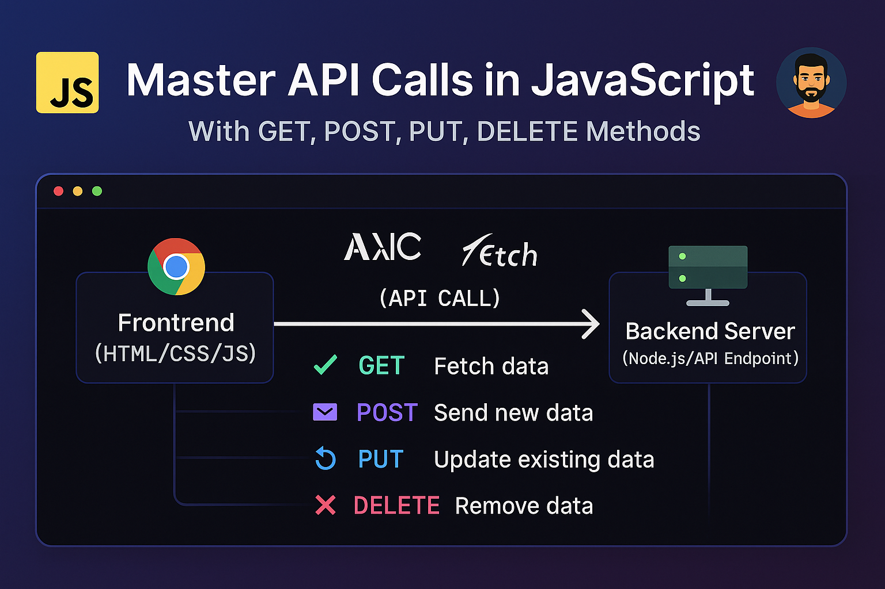

---
<p align="center">
  
</p>

<h1 align="center">📡✨ API Call in JavaScript</h1>

---

## 📘 Table of Contents

- [👋 Welcome](#-welcome)
- [❓ What is an API Call in JavaScript?](#-what-is-an-api-call-in-javascript)
- [🚀 Ways to Make an API Call](#-ways-to-make-an-api-call)
  - [🔹 XMLHttpRequest](#-xmlhttprequest)
  - [🔹 Fetch API](#-fetch-api)
    - [🔸 Method 1 - Using Promises](#-method-1---using-promises)
    - [🔸 Method 2 - Using Async/Await](#-method-2---using-asyncawait)
  - [🔹 Axios](#-axios)
  - [🔹 jQuery AJAX](#-jquery-ajax)
- [✅ Conclusion](#-conclusion)
- [🧑‍💻 About the Author](#-about-the-author)

---

## 👋 Welcome

Hello Everyone! 👋 I'm **`Sajib Bhattacharjee`**, a passionate **Full-Stack Web Developer** 👨‍💻.

Welcome to this comprehensive guide on **making API calls using JavaScript**! 🌐💡

---

## ❓ What is an API Call in JavaScript?

> 📌 API (Application Programming Interface) is a software intermediary that allows two applications to communicate.

Every time you:
- 📱 Check weather updates,
- 💬 Send messages,
- 🛍️ Browse products online — you're using an API!

In web development, the **front-end** uses **API calls** to interact with the **back-end** to fetch dynamic data.

```js
// Simple definition
API = Frontend ⟷ Backend
```

---

## 🚀 Ways to Make an API Call

JavaScript provides several methods (native & external) to make API requests:

✅ `XMLHttpRequest`

✅ `Fetch API`

✅ `Axios (Library)`

✅ `jQuery AJAX`

---

### 🔹 XMLHttpRequest

📜 **Legacy Method** (Still supported, especially for older browsers)

```js
var XMLRequest = new XMLHttpRequest();

XMLRequest.open("GET", "https://reqres.in/api/users/2");
XMLRequest.send();

XMLRequest.onload = () => {
  if (XMLRequest.status === 200) {
    console.log("✅ Request successful");
  } else {
    console.log("❌ Error occurred!");
  }

  console.log(JSON.parse(XMLRequest.response));
};
```

📌 *Note*: Returns response as a string by default. Use `JSON.parse()` to convert.

⚠️ Deprecated in favor of modern methods like `fetch()`.

---

### 🔹 Fetch API

✅ **Modern, Promise-based** API introduced in ES6.

#### 🔸 Method 1 - Using Promises

```js
fetch('https://reqres.in/api/users/2')
  .then(response => response.json())
  .then(data => {
    console.log(data);
  })
  .catch(err => console.error("❌ Error:", err));
```

#### 🔸 Method 2 - Using Async/Await

```js
async function getUserData() {
  try {
    let response = await fetch("https://reqres.in/api/users/2");
    let data = await response.json();
    console.log(data);
  } catch (error) {
    console.error("❌ Error:", error);
  }
}

getUserData();
```

🌟 *Pros*: Readable, clean, and native support

⚠️ *Cons*: Needs manual error handling

---

### 🔹 Axios

🧰 **Popular External Library** (Works with both browser & Node.js)

#### 🔧 Installation

- **Using NPM/Yarn**:
```bash
npm install axios
# or
yarn add axios
```

- **CDN Link**:
```html
<script src="https://unpkg.com/axios/dist/axios.min.js"></script>
```

#### 📦 Example Usage

```html
<script>
  axios.get("https://reqres.in/api/users/2")
    .then(response => console.log(response.data))
    .catch(error => console.error("❌ Error:", error));
</script>
```

🌟 *Pros*:
- Auto JSON parsing 📦
- Better error handling ✔️
- Works across all modern browsers 🌍

---

### 🔹 jQuery AJAX

📜 Uses `$.ajax()` method for async requests.

#### 🔧 Include jQuery:
```html
<script src="https://ajax.googleapis.com/ajax/libs/jquery/3.3.1/jquery.min.js"></script>
```

#### 📦 Example:
```html
<script>
  $(document).ready(function () {
    $.ajax({
      url: "https://reqres.in/api/users/2",
      type: "GET",
      success: function (result) {
        console.log(result);
      },
      error: function (error) {
        console.log("❌", error);
      },
    });
  });
</script>
```

✅ Includes `success` & `error` callbacks.

---

## ✅ Conclusion

🧠 **Summary:**

- **XMLHttpRequest** — 🕰️ Older, still usable
- **Fetch API** — 🆕 Native, promise-based
- **Axios** — 🔥 Feature-rich, widely used
- **jQuery AJAX** — ✅ Legacy support with jQuery

🏆 **Recommendation:** Use `Axios` or `Fetch` for modern development!

---

## 🧑‍💻 About the Author

<div align="center">

#### 💬 All rights reserved © **Sajib Bhattacharjee** — 2025 🕊️

#### 🎨 Created with ❤️ for **"Sir! Anisul Islam"** 💕

### 👉 Thanks a lot for visiting! 🌟

---

#### 📬 Connect with Me:

<a href="https://github.com/SajibBhattacharjee" target="_blank">GitHub</a> | 
<a href="https://www.linkedin.com/in/sajib-bhattacharjee-42682a178/" target="_blank">LinkedIn</a> | 
<a href="mailto:sajibbhattacharjee2000@gmail.com">Email</a>

</div>

---

